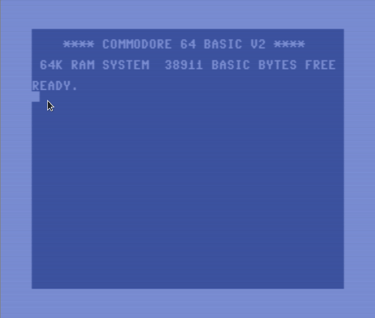

# Println and readln

Inspired by
https://stackoverflow.com/questions/68240543/6510-6502-c64-keyboard-input-print-to-screen-store-in-memory-issue.

This code was written for the [64tass][] assembler and tested using the `x64sc` component of the [VICE][] emulator.

## Building

```
64tass -o getname.prg getname.s
```

## Running

```
x64sc ./getname.prg
```

[64tass]: http://tass64.sourceforge.net/
[vice]: https://vice-emu.sourceforge.io/

## Demo


